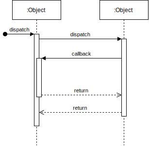

## Some examples for flavored .md

### An example of how to integrate .svd diagrams generated from https://app.diagrams.net/ or the [local tool](https://github.com/jgraph/drawio-desktop/releases/latest)

1. Create your diagram.
1. Save it in .svd format.
1. Pull the file into your repo.
1. Include it into your .md files. using ``
1. Don't forget to save the .drawio(xml) file so anyone can edit the diagram.

### Simply inserting the diagram:

### Use html to align the diagram:

          

### Some table examples

<table>
    <tr>
        <th>Value</th>
        <th>Character</th>
    </tr>
    <tr>
        <td>10</td>
        <td>X</td>
    </tr>
    <tr>
        <td>100</td>
        <td>C</td>
    </tr>
    <tr>
        <td>1000</td>
        <td>M</td>
    </tr>
    <tr>
        <td>500</td>
        <td>L</td>
    </tr>
</table>

- Multi-column

<table>
    <tr>
        <th>ColumnA</th>
        <th>ColumnB</th>
        <th>ColumnC</th>
        <th>ColumnD</th>
    </tr>
    <tr>
        <td>RowA</td>
        <td>RowB</td>
        <td>RowC</td>
        <td>RowD</td>
    </tr>
</table>
